<html lang="en">
<head>
    <meta charset="UTF-8">
    <meta name="viewport" content="width=device-width, initial-scale=1.0">
    <link rel="stylesheet" href="styles.css">
</head>
<body>

    <h1>My GitHub Profile</h1>
    <h3>Let's connect</h3>
    
City: https://torshkhoevnr06.github.io/nakir-my-website/

    
Email: nakir3000@gmail.com

</body>
</html>
